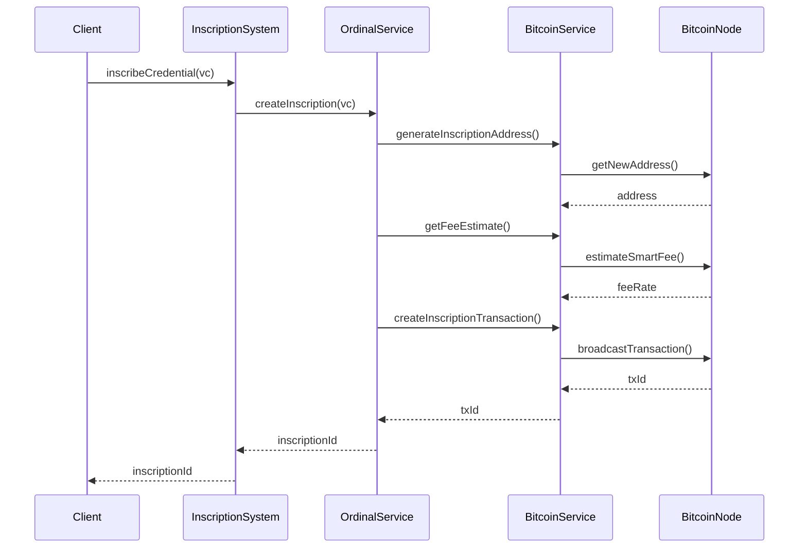
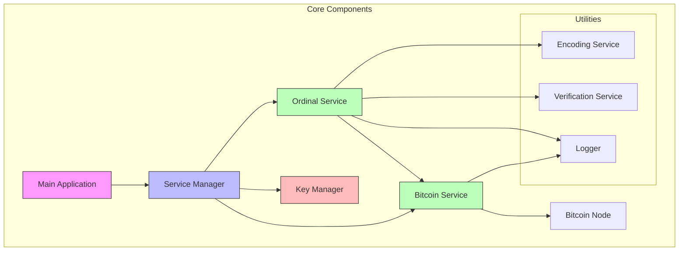

# Bitcoin Ordinal Inscription System

A robust system for inscribing and verifying W3C Verifiable Credentials on the Bitcoin blockchain using Ordinals.

## System Architecture

The system follows a modular architecture with clear separation of concerns. Each component is designed to be maintainable, testable, and scalable.



### Core Components



1. **Main Application (OrdinalInscriptionSystem)**

   - Entry point for the application
   - Manages high-level operations
   - Provides a clean API for credential inscription and verification

2. **Service Manager**

   - Implements the Singleton pattern
   - Manages service initialization and dependencies
   - Provides centralized access to all services

3. **Bitcoin Service**

   - Handles all Bitcoin network interactions
   - Manages wallet operations
   - Implements transaction creation and broadcasting

4. **Ordinal Service**

   - Manages ordinal inscription operations
   - Handles credential encoding and inscription
   - Implements verification logic

5. **Key Manager**
   - Manages cryptographic keys
   - Implements secure key generation and storage
   - Handles transaction signing

### Utilities

1. **Encoding Service**

   - Implements custom encoding scheme for credentials
   - Handles data compression and decompression
   - Includes error correction mechanisms

2. **Verification Service**

   - Validates credential structure and content
   - Verifies cryptographic proofs
   - Checks temporal validity

3. **Logger**
   - Provides structured logging
   - Supports multiple log levels
   - Enables debugging and monitoring

## API Usage

### Installation

```bash
npm install bitcoin-ordinal-vc
```

### Basic Usage

```typescript
import { OrdinalInscriptionSystem } from "bitcoin-ordinal-vc";

// Initialize the system
const system = new OrdinalInscriptionSystem();

// Inscribe a credential
const inscriptionId = await system.inscribeCredential(verifiableCredential);

// Verify a credential
const verifiedCredential = await system.verifyCredential(inscriptionId);
```

### API Methods

1. `inscribeCredential(credential: IdentityVerifiableCredential): Promise<string>`

   - Inscribes a verifiable credential onto the Bitcoin blockchain
   - Returns the inscription ID

2. `verifyCredential(inscriptionId: string): Promise<IdentityVerifiableCredential>`

   - Retrieves and verifies a credential from the blockchain
   - Returns the verified credential

3. `getBlockchainStatus(): Promise<any>`
   - Returns current blockchain status
   - Useful for monitoring system health

## Deployment Instructions

### Prerequisites

1. Bitcoin Node Setup

   ```bash
   # Install Bitcoin Core
   # Configure bitcoin.conf
   bitcoin-core -testnet  # For testnet deployment
   ```

2. Environment Configuration

   ```bash
   # Create .env file
   BITCOIN_NETWORK=testnet
   BITCOIN_NODE_URL=http://localhost:18332
   BITCOIN_RPC_USER=your_username
   BITCOIN_RPC_PASSWORD=your_password
   ```

3. System Requirements
   - Node.js v16 or higher
   - 8GB RAM minimum
   - 500GB storage for testnet

### Development Setup

1. Clone the repository:

   ```bash
   git clone https://github.com/your-repo/bitcoin-ordinal-vc.git
   cd bitcoin-ordinal-vc
   ```

2. Install dependencies:

   ```bash
   npm install
   ```

3. Build the project:
   ```bash
   npm run build
   ```

### Production Deployment

1. Security Considerations

   - Use secure key storage
   - Implement proper access controls
   - Regular security audits

2. Monitoring Setup

   - Configure logging
   - Set up alerts
   - Monitor blockchain status

3. Scaling Considerations
   - Load balancing for multiple instances
   - Database scaling for credential caching
   - Backup and recovery procedures

## Best Practices

1. **Key Management**

   - Use hardware security modules when possible
   - Regular key rotation
   - Secure backup procedures

2. **Error Handling**

   - Implement proper error recovery
   - Log all errors with context
   - Monitor error rates

3. **Performance Optimization**
   - Batch inscriptions when possible
   - Implement caching strategies
   - Monitor resource usage

## Troubleshooting

Common issues and their solutions:

1. Connection Issues

   - Check Bitcoin node status
   - Verify RPC credentials
   - Check network connectivity

2. Inscription Failures

   - Verify sufficient funds
   - Check fee estimates
   - Validate credential format

3. Verification Issues
   - Check inscription ID format
   - Verify blockchain synchronization
   - Validate credential structure
